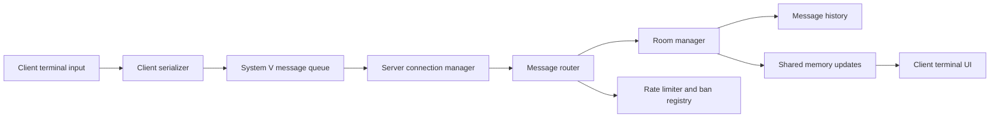
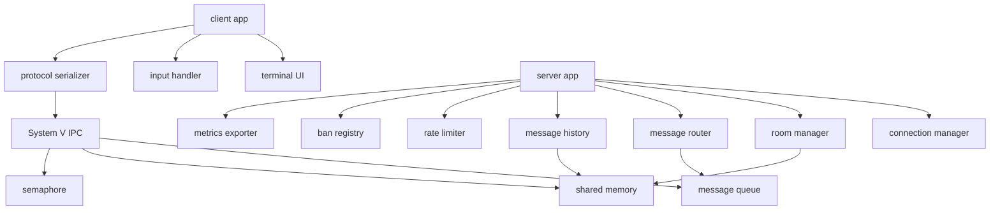

# ChatterBox

Terminal chat system built in C++17 with System V IPC, POSIX threads, a custom binary protocol, shared-memory primitives, room management, moderation controls, and stress/integration tests.

ChatterBox is a systems-programming project focused on the hard parts of realtime terminal collaboration: message serialization, IPC lifecycle management, room routing, rate limiting, bans, history retention, metrics, signal handling, and concurrent client/server execution.

## Contents

- [At A Glance](#at-a-glance)
- [Runtime Model](#runtime-model)
- [Architecture](#architecture)
- [Feature Map](#feature-map)
- [Tech Stack](#tech-stack)
- [Repository Map](#repository-map)
- [Build And Run](#build-and-run)
- [Verification](#verification)
- [Status](#status)
- [License](#license)

## At A Glance

| Area | Details |
|---|---|
| Product | Terminal multi-user chat server and client |
| Focus | C++ concurrency, IPC, protocol serialization, and server routing |
| Users | Systems developers and students evaluating IPC-heavy architecture |
| Server features | Rooms, message routing, bans, rate limits, history, metrics |
| Client features | Terminal UI, input handler, binary protocol client |
| Tests | Unit, integration, and stress test folders |

## Runtime Model



## Architecture



## Feature Map

| Feature | Evidence in repo |
|---|---|
| Server runtime | `src/server/server.cpp`, `apps/server_main.cpp` |
| Client runtime | `src/client/client.cpp`, `apps/client_main.cpp` |
| IPC wrappers | `src/ipc/`, `include/chatterbox/ipc/` |
| Protocol serialization | `src/protocol/`, `include/chatterbox/protocol/` |
| Room routing | `src/server/room_manager.cpp`, `message_router.cpp` |
| Moderation controls | `ban_registry.cpp`, `rate_limiter.cpp` |
| Metrics | `metrics_exporter.cpp` |
| Tests | `tests/unit/`, `tests/integration/`, `tests/stress/` |
| Additional architecture docs | `docs/ARCHITECTURE.md` |

## Tech Stack

| Layer | Technology |
|---|---|
| Language | C++17 |
| Concurrency | POSIX threads, custom sync wrappers |
| IPC | System V message queues, shared memory, semaphores |
| Build | Makefile and CMake |
| Tests | Unit, integration, stress test targets |

## Repository Map

```text
apps/       server and client entrypoints
src/        implementation by subsystem
include/    public headers
tests/      unit, integration, and stress tests
docs/       architecture notes
```

## Build And Run

Makefile flow verified in this environment:

```bash
make all
```

Preferred CMake flow:

```bash
cmake -B build -DCMAKE_BUILD_TYPE=Release
cmake --build build
```

CMake was not verified in this pass because `cmake` is not installed locally.

Server and client flags:

```bash
build/chatterbox_server -p 42 -u 5 -t 2
build/chatterbox_client -s 42 -n -r Alice
```

The `-p` server offset and `-s` client offset must match. `-n` runs the client without the ncurses UI, and `-r` disables reconnect loops for deterministic local testing.

Help commands:

```bash
build/chatterbox_server --help
build/chatterbox_client --help
```

A verified no-UI CLI run is captured in [`docs/cli-session.txt`](docs/cli-session.txt).

## Verification

Local verification:

| Check | Result |
|---|---|
| `cmake --version` | Not run locally; `cmake` is unavailable in this environment |
| `make -B all` | Passed; warnings remain for unused parameters/fields and constructor field reorder |
| `make all` | Passed after the connection-manager callback deadlock fix |
| `build/chatterbox_server --help` | Passed |
| `build/chatterbox_client --help` | Passed |
| `build/chatterbox_server -p 142 -u 5 -t 2` | Started, accepted clients, routed messages, and stopped cleanly on SIGINT |
| delayed no-UI client run with `/users`, message, `/quit` | Passed; client received the user list and its chat broadcast |

Runtime transcript: [`docs/cli-session.txt`](docs/cli-session.txt).

## Status

The Makefile build, client/server connect-response path, no-UI client loop, user-list request, chat broadcast, and server shutdown path are verified. Remaining polish is to reduce compiler warnings and expand the ncurses UI demo coverage.

## License

MIT. See [LICENSE](LICENSE).
